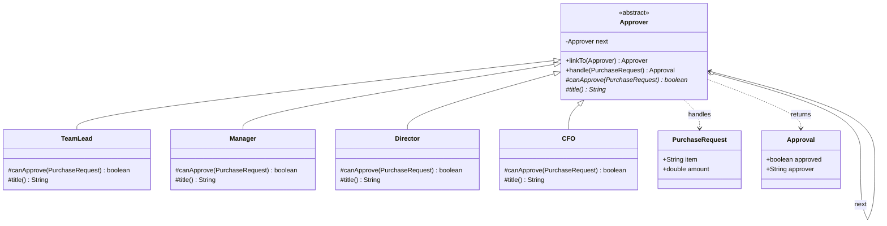

# Chain of Responsibility (Behavioral)

**Intent:** avoid coupling the sender of a request to its receiver by giving more
than one object a chance to handle it. Chain the receivers and pass the request
along until one handles it.

## What the pattern is

You have a request and several objects that *might* handle it, but the sender
shouldn't have to know which one will. Each potential handler is wrapped in an
object that holds a reference to the **next** handler, forming a chain. When a
request arrives, a handler makes one decision: *can I handle this?* If yes, it
handles it and stops; if no, it passes the request to the next handler. If the
request reaches the end unhandled, it's rejected.

The payoff is **decoupling and flexibility**: the sender fires the request at the
head of the chain and stays ignorant of who handles it, and you can add, remove,
or reorder handlers by changing how the chain is *wired* — no handler's code and
no sender's code has to change.

## The anti-pattern it replaces

Without it, the sender owns a giant decision ladder and knows every receiver:

```java
// Smell: one place decides who handles it — coupled to all handlers
if      (amount <= 1_000)     approveAsTeamLead();
else if (amount <= 10_000)    approveAsManager();
else if (amount <= 100_000)   approveAsDirector();
else if (amount <= 1_000_000) approveAsCFO();
else                          deny();
```

Insert a "VP" tier or reorder approvals and you reopen this ladder every time; the
sender can't be reused without dragging all receivers along.

**What it solves:** each handler owns only its own decision plus a link to the
next, so the sender fires once at the head and stays ignorant, and you add /
remove / reorder handlers by rewiring — not editing.

## Recall hook

- **The smell that triggers it:** a long `if/else-if` (or `switch`) picking *who*
  handles a request, with the caller aware of them all.
- **In one line:** *pass the request down a line of handlers until one takes it.*
- **Analogy:** escalating a support ticket up the tiers, or an approval climbing
  the org chart.
- **Tell it apart from State:** Chain asks *"who handles this?"* (pick one of many
  receivers); State asks *"how do I behave now?"* (my own mode changed).

## Real-life use case

The **expense-approval feature of a company purchasing tool** (Concur / Expensify
style, or GitHub required reviewers). An employee files a purchase request; who
may approve depends on the amount — Team Lead (≤ $1,000) → Manager (≤ $10,000) →
Director (≤ $100,000) → CFO (≤ $1,000,000) → otherwise denied. The employee never
learns the org chart; they just submit and the request travels up until someone
with authority approves. Insert a new "VP" tier later and the submit code stays
untouched — only the chain's wiring changes.

> The same shape shows up in HTTP **middleware** pipelines, **support-ticket
> escalation**, servlet filters, and UI event bubbling.

## UML



The `o--> next` self-link is the chain itself: each approver points to the next,
and the inherited `handle()` walks it until someone approves or the chain ends.

## What's in this package

| Type | Role |
| --- | --- |
| [`Approver.java`](Approver.java) | abstract handler — holds the `next` link and the single inherited `handle()` routing |
| [`TeamLead`](TeamLead.java), [`Manager`](Manager.java), [`Director`](Director.java), [`CFO`](CFO.java) | concrete handlers — each defines its own authority (`canApprove`) |
| [`PurchaseRequest.java`](PurchaseRequest.java) | the request flowing down the chain |
| [`Approval.java`](Approval.java) | the result — approved-by-title, or denied |

The request/result types and the `linkTo`/`next` wiring are provided; the
**routing and each approver's authority** are the exercise.

## The exercise

Fill in the `TODO`s:

1. **`Approver.handle(request)`** — the heart of the pattern. Written once, in
   the base class:
   - if this approver `canApprove(request)` → `return Approval.by(title())`;
   - else if there's a `next()` approver → delegate to it;
   - else → `return Approval.denied()`.

2. **Each concrete approver** — `TeamLead`, `Manager`, `Director`, `CFO`:
   implement `canApprove(...)` (its dollar authority, inclusive) and `title()`.

### Rules of the game

- Don't put the routing logic in the concrete approvers — `handle` lives in the
  base and is inherited unchanged by all four. That's what keeps the sender
  decoupled.
- Don't change `PurchaseRequest`, `Approval`, or the provided `linkTo` / `next`.
- The **first** capable approver in the chain wins — a $500 buy is approved by
  the Team Lead even though the Manager above could also approve it.

### Done means

```powershell
mvn test -Dtest='PurchaseApprovalTest'
```

is green. The test names in
[`PurchaseApprovalTest.java`](../../../../test/java/patterns/chainofresponsibility/PurchaseApprovalTest.java)
spell out every behavior: escalation, boundaries, first-capable-wins, and denial
off the end of the chain.

### Stretch goals (optional, no tests)

- Insert a `VP` tier (up to $500,000) between Director and CFO **without touching
  any existing approver** — only the wiring changes. That's the payoff of the
  pattern.
- Add an audit trail: have `handle` record which approvers a request passed
  through before being approved or denied.
- Make an approver that handles on a non-numeric rule (e.g. a `SecurityReview`
  link that must approve any request whose `item` contains "server"), proving
  handlers can use arbitrary criteria, not just thresholds.
