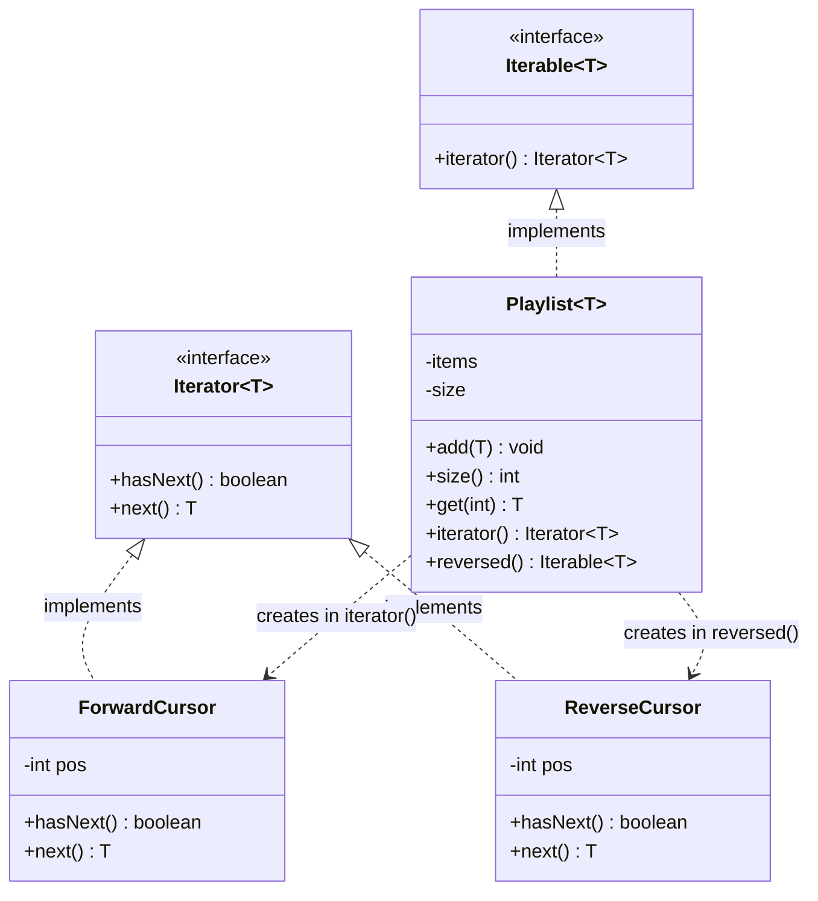

# Iterator (Behavioral)

**Intent:** provide a way to access the elements of an aggregate object
sequentially *without exposing its underlying representation*.

## What the pattern is

A collection knows *how* it stores its elements (array, linked list, tree,
paged fetches). A client usually just wants to walk over them one at a time. The
Iterator pattern moves that "walk" into a separate **cursor** object that tracks
its own position and offers a tiny interface — typically `hasNext()` and
`next()`. Because the cursor is separate from the collection:

- the client never touches the internal storage, so the collection can change its
  representation without breaking any client;
- you can run **several independent walks** over the same collection at once
  (each cursor has its own position);
- and you can offer **different orders** (forward, reverse, filtered) as
  different cursors over the same data.

In Java the pattern is baked into the language: an aggregate implements
`Iterable<T>`, a cursor implements `Iterator<T>`, and the `for-each` loop drives
them for you.

## The anti-pattern it replaces

Without it, callers reach into the collection's guts — or the collection leaks
them:

```java
// Smell: the caller knows HOW the playlist is stored
Object[] raw = playlist.getItems();            // internal array exposed
for (int i = 0; i < playlist.getCount(); i++) {
    play(raw[i]);
}
```

Every caller is now welded to "it's an array." Switch to a linked list or paged
fetches and they all break; two loops can't run at once without clashing over one
shared index; a reverse walk means a second hand-rolled loop copied everywhere.

**What it solves:** hides the representation behind a cursor, so storage can change
freely, many walks run independently, and alternate orders are just other cursors.

## Recall hook

- **The smell that triggers it:** you're indexing into someone else's internal
  array, or a class exposed a `getItems()` / `getCount()` pair.
- **In one line:** *a cursor that walks a collection without revealing how it's
  stored.*
- **Analogy:** a bookmark moving through a book — you go `next` page to page, never
  seeing how the book is bound.

## Real-life use case

A **music streaming app's playlist**. Several screens walk the **same** playlist
at once — the now-playing bar and the full queue screen each hold their own
position — some walk it in a different order ("previous track" goes backward),
and none of them should care whether it's stored as an array, a linked list, or
server-streamed pages. Give each walker its own cursor and all of that falls out
for free.

## UML



`ForwardCursor` / `ReverseCursor` are the cursors you write (an inner or
anonymous class is fine); each keeps its own `pos`, which is what lets multiple
walks run independently.

## What's in this package

| Type | Role |
| --- | --- |
| [`Playlist.java`](Playlist.java) | the aggregate — stores items, hands out cursors (`iterator()`, `reversed()`) |
| `java.util.Iterator<T>` | the cursor interface each walk implements (hand-written here) |

The storage (`add` / `size` / `get`) is provided; the **traversal** is the
exercise.

## The exercise

`Playlist<T>` stores its items in a plain `Object[]` that grows as needed — that
part is written for you. Your job is the traversal: make `Playlist` hand out your
own hand-written `Iterator<T>`. Open [`Playlist.java`](Playlist.java) and fill in
the `TODO`s:

1. **`iterator()`** — return an `Iterator<T>` that yields the items in insertion
   order (index `0` first). Write the cursor yourself as an inner class; keep its
   own position field. Do **not** copy the array into an `ArrayList` and return
   `list.iterator()` — the whole point is to build the cursor.
   - `hasNext()` reports whether any items remain.
   - `next()` returns the current item and advances.
   - when there are no more items, `next()` throws
     `java.util.NoSuchElementException`.

2. **`reversed()`** — return an `Iterable<T>` whose iterator walks the *same*
   items from the last one to the first. Same storage, different order — this is
   what "decouple traversal from the collection" buys you.

### Rules of the game

- Don't change the storage fields or the provided `add` / `size` / `get`.
- Don't delegate to `Arrays.asList(...).iterator()` or `List.iterator()`.
  Build the cursor from the raw array and an index.
- Two iterators obtained from the same playlist must advance **independently**
  (no shared cursor state on the `Playlist` itself).

### Done means

```powershell
mvn test -Dtest='PlaylistTest'
```

is green. The test names in
[`PlaylistTest.java`](../../../../test/java/patterns/iterator/PlaylistTest.java)
spell out every behavior above.

### Stretch goals (optional, no tests)

- Add a `filtered(Predicate<T>)` that returns an `Iterable<T>` skipping items
  that don't match — a lazy filtering cursor, computing the next match on demand.
- Make the forward iterator *fail-fast*: if the playlist is modified (an `add`)
  after the iterator is created, the next `next()` throws
  `ConcurrentModificationException`. (This is how `ArrayList` protects you.)
