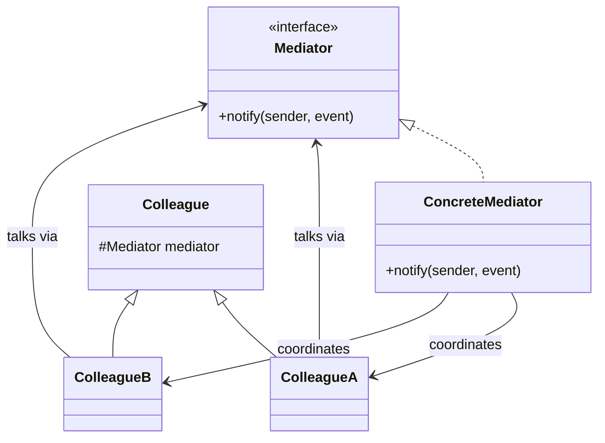

# Mediator (Behavioral)

**Intent:** define an object that encapsulates how a set of objects interact.
Mediator promotes loose coupling by keeping objects from referring to each other
explicitly, and lets you vary their interaction independently.

> **Format:** this is a *tests-first* exercise. There is **no starter code** — you
> design and build every class yourself. The test suite
> ([`ChatRoomTest.java`](../../../../test/java/patterns/mediator/ChatRoomTest.java))
> is the spec: it pins the required public API and behavior; the internal
> structure — which class is the hub, who holds a reference to whom, whether you
> introduce an interface — is what *you* deduce. That deduction is the point.

## What the pattern is

When many objects need to interact, the tempting design is to let each one hold
references to all the others and call them directly. The Mediator pattern instead
introduces a single **mediator** object that sits in the middle: every
participant (a *colleague*) talks only to the mediator, and the mediator decides
who else needs to know. All the "who coordinates with whom" logic lives in one
place instead of being smeared across every participant.

## The anti-pattern it replaces

Without it, participants wire directly to each other — an all-to-all mesh:

```java
// Smell: every participant holds and drives every other one
class User {
    List<User> peers;                     // knows all the others
    void send(String msg) {
        for (User p : peers) p.receive(name, msg);   // calls them directly
    }
}
// add a participant  -> update everyone's peer list
// change a delivery rule -> edit it inside every participant
```

With *n* participants that's up to *n²* connections, and every interaction rule is
duplicated. Reworking how they coordinate means touching all of them.

**What it solves:** each participant knows only the mediator; the interaction
rules live in the mediator alone. Add, remove, or re-route participants by
changing one object, not every object.

## Recall hook

- **The smell that triggers it:** objects holding references to *many* sibling
  objects and calling each other directly — a growing many-to-many mesh.
- **In one line:** *a central hub that coordinates a set of objects so they never
  talk to each other directly.*
- **Analogy:** an air-traffic-control tower — planes talk to the tower, never
  plane-to-plane; or a group-chat channel routing every message.
- **Tell it apart:** a **Facade** simplifies a subsystem one-way (callers → facade
  → subsystem, no back-talk); a **Mediator** sits between *peers* and coordinates
  them **bidirectionally**.

## Real-life use case

A **group chat channel** (Slack channel, WhatsApp group). Members don't hold
direct connections to each other; they post to the channel and the channel fans
the message out to the other members. Joining, leaving, muting, or changing how
messages are delivered is a change to the channel — the members are untouched.

## The pattern shape (map it onto the problem yourself)



That's the pattern in the abstract. Deciding what the *mediator* and the
*colleague* are in a chat, and wiring them so no colleague points at another
colleague, is your job.

## Your task

Build the classes, from scratch, that make the test suite pass. Read
[`ChatRoomTest.java`](../../../../test/java/patterns/mediator/ChatRoomTest.java)
first — it tells you the class names, constructors, methods, and the exact
message format you must produce. From that spec, design the structure yourself.

### Rules of the game (what makes it Mediator, not just a mesh that passes)

- The behavior tests could be satisfied by the anti-pattern mesh above. To
  actually build **Mediator**, honor its contract: **a colleague must not hold a
  reference to, or call, another colleague.** Every message goes *through* the
  hub.
- All the "who receives what" logic lives in the mediator, in one place.
- Don't edit the test to fit your design — design to fit the test.

### Done means

```powershell
mvn test -Dtest='ChatRoomTest'
```

is green. Right now the package has no classes, so it won't even compile — that's
your starting line.

## Stretch goals (optional, no tests)

- Add a **direct message** (`whisper(to, message)`) that routes through the
  mediator to a single recipient — proving new interactions are added in the hub,
  not the participants.
- Add **mute**: a member the channel skips when fanning out — again, a change to
  the mediator alone.
- Add a second kind of participant (e.g. a `BotUser` that auto-replies) and note
  that the mediator coordinates it without any participant knowing its type.
