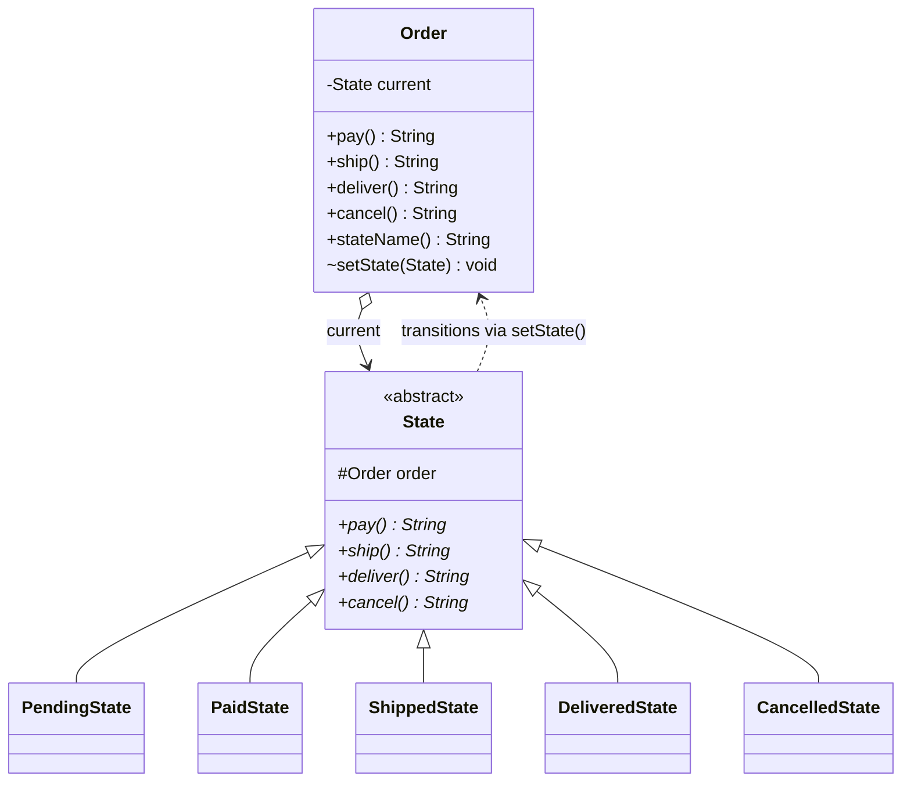

# State (Behavioral)

**Intent:** allow an object to alter its behavior when its internal state
changes. The object will appear to change its class.

## What the pattern is

Some objects behave differently depending on what "mode" they're in, and the
usual first attempt — a status field plus a big `switch`/`if` in every method —
rots fast: the same tangle of conditionals is copy-pasted into every method, and
adding a state means editing all of them.

The State pattern turns each mode into its own **class** that implements a common
interface. The main object (the **context**) holds a reference to the current
state object and simply **delegates** every event to it. Each state class handles
those events its own way and, when appropriate, tells the context to switch to a
different state. Behavior changes by swapping the state object, not by branching —
so adding a new mode is a new class, not an edit to every method.

## The anti-pattern it replaces

Without it, a status field drives the same `switch` in every method:

```java
// Smell: the same switch on `status`, copy-pasted into pay(), ship(), cancel()...
String cancel() {
    switch (status) {
        case PENDING: status = CANCELLED; return "Order cancelled.";
        case PAID:    status = CANCELLED; refund(); return "...refunded.";
        case SHIPPED: return "Cannot cancel: already shipped.";
        // ...one arm per state — and this whole switch repeats in pay/ship/deliver
    }
}
```

Add an "on-hold" stage and you must hunt down and edit every one of those
switches — miss one and behavior silently diverges.

**What it solves:** each mode becomes one class holding all its own behavior and
transitions; the context just delegates, so adding a mode is a new class and no
edits to the existing ones.

## Recall hook

- **The smell that triggers it:** the same `switch (status)` / mode-`if` ladder
  repeated across several methods.
- **In one line:** *swap the object's behavior by swapping a state object.*
- **Analogy:** a traffic light or an order lifecycle — the same button does
  different things depending on the current stage.
- **Tell it apart from Chain:** State asks *"how do I behave now?"* (my mode
  changed over time); Chain asks *"who handles this?"* (one of many receivers).

## Real-life use case

An **e-commerce order's lifecycle**. An order moves through *pending → paid →
shipped → delivered*, or off to *cancelled*. The same event means different things
at each stage: `cancel()` on a pending order just voids it, on a paid order must
also **refund**, and on a shipped order is **refused** — it's already in transit.
`ship()` before payment is illegal; `deliver()` before shipping is illegal.
Model each stage as a state object and the order just forwards `pay` / `ship` /
`deliver` / `cancel` to whichever one is active.

> The same shape drives payment flows, document workflows (draft → review →
> published), media players (stopped/playing/paused), and TCP connections.

## UML



Note the two-way link: the order points at its current `State`, and each state
points back at the order so it can trigger the next transition.

## What's in this package

| Type | Role |
| --- | --- |
| [`Order.java`](Order.java) | the **context** — holds the current state and delegates every event |
| [`State.java`](State.java) | abstract **state** — the interface every stage implements |
| [`PendingState`](PendingState.java), [`PaidState`](PaidState.java), [`ShippedState`](ShippedState.java), [`DeliveredState`](DeliveredState.java), [`CancelledState`](CancelledState.java) | concrete **states** — each defines behavior for one stage and the legal transitions out of it |

The context and the `State` base are provided; the five concrete states'
behavior and transitions are the exercise.

## The exercise

Implement the five concrete states' `TODO`s so they match this **behavior table**
exactly (the tests assert these messages verbatim):

| State | `pay()` | `ship()` | `deliver()` | `cancel()` |
| --- | --- | --- | --- | --- |
| **PendingState** | → Paid; `"Payment received."` | `"Cannot ship: order not paid yet."` | `"Cannot deliver: order not shipped yet."` | → Cancelled; `"Order cancelled."` |
| **PaidState** | `"Order is already paid."` | → Shipped; `"Order shipped."` | `"Cannot deliver: order not shipped yet."` | → Cancelled; `"Order cancelled and payment refunded."` |
| **ShippedState** | `"Order is already paid."` | `"Order is already shipped."` | → Delivered; `"Order delivered."` | `"Cannot cancel: order already shipped."` |
| **DeliveredState** | `"Order is already paid."` | `"Order is already shipped."` | `"Order is already delivered."` | `"Cannot cancel: order already delivered."` |
| **CancelledState** | `"Order was cancelled."` | `"Order was cancelled."` | `"Order was cancelled."` | `"Order is already cancelled."` |

Transitions happen by calling `order.setState(order.paidState())` and friends. A
new `Order` starts in `PendingState` (already wired for you). `DeliveredState`
and `CancelledState` are terminal — they reject everything.

### Rules of the game

- No `switch`/`if` on a "current state" / status variable anywhere — that's the
  anti-pattern this replaces. Each state's methods just do the right thing
  directly.
- Don't change `Order` or `State`. Keep the state class names exactly as above
  (the tests read them via `stateName()`).
- A state changes the order only through the provided `setState(...)` and the
  `xxxState()` accessors.

### Done means

```powershell
mvn test -Dtest='OrderTest'
```

is green. The 13 tests in
[`OrderTest.java`](../../../../test/java/patterns/state/OrderTest.java) cover every
legal transition, the illegal ones, both terminal states, and the headline
property: the same `cancel()` call behaves differently at each stage.

### Stretch goals (optional, no tests)

- Add a `RETURNED` stage reachable from `DeliveredState` (`returnOrder()`), then a
  `refund()` from there — without touching the other states.
- Add an `OnHoldState` (e.g. fraud review) you can enter from `PaidState` and
  leave back to `PaidState`. Notice you add one class and edit nothing existing.
- Give `Order` an amount and have `PaidState.cancel()` actually compute and expose
  the refunded total.
